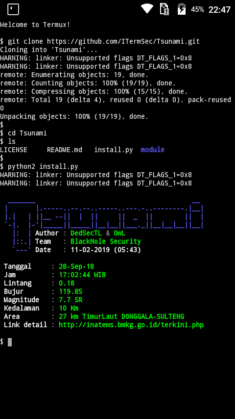

# Tsunami
Tsunami data from BMKG Indonesia. Tanpa pip install request, agar pengguna Terminal Emulator android juga bisa merasakan tools yang di pakai oleh Termux
# Install
```bash
$ apt install git
$ pkg install python2
$ git clone https://ITermSec/Tsunami.git
$ cd Tsunami
$ python2 install.py
```
# Screenshot

